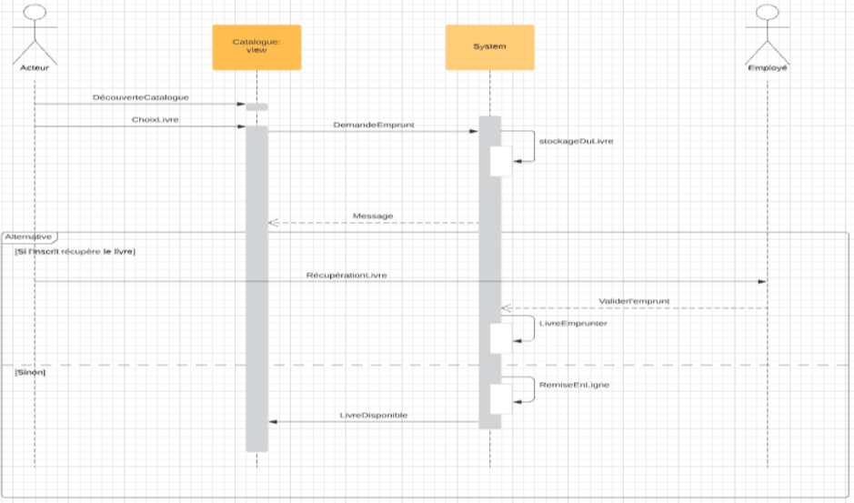

# Médiathèque 

Médiathèque est un projet que j'avais réaliser pour un projet un php/symfony, 
j'ai décidé de le remastériser en Java.

# Getting Started

### Reference Documentation
For further reference, please consider the following sections:

* [Official Apache Maven documentation](https://maven.apache.org/guides/index.html)
* [Spring Boot Maven Plugin Reference Guide](https://docs.spring.io/spring-boot/docs/2.7.2/maven-plugin/reference/html/)
* [Create an OCI image](https://docs.spring.io/spring-boot/docs/2.7.2/maven-plugin/reference/html/#build-image)
* [Spring Boot DevTools](https://docs.spring.io/spring-boot/docs/2.7.2/reference/htmlsingle/#using.devtools)
* [Spring Data JPA](https://docs.spring.io/spring-boot/docs/2.7.2/reference/htmlsingle/#data.sql.jpa-and-spring-data)
* [Spring Web](https://docs.spring.io/spring-boot/docs/2.7.2/reference/htmlsingle/#web)

### Guides
The following guides illustrate how to use some features concretely:

* [Accessing Data with JPA](https://spring.io/guides/gs/accessing-data-jpa/)
* [Accessing data with MySQL](https://spring.io/guides/gs/accessing-data-mysql/)
* [Building a RESTful Web Service](https://spring.io/guides/gs/rest-service/)
* [Serving Web Content with Spring MVC](https://spring.io/guides/gs/serving-web-content/)
* [Building REST services with Spring](https://spring.io/guides/tutorials/rest/)

## Résumé du projet

Le projet Médiathèque est une application web de click and collecte de livre pour une
médiathèque. L’utilisateur et l’admin pourront ce connecté, les données seront sécurisées par un
filtrage des inputs et hachage des mot de passe. L’utilisateur découvre alors les catalogue de livre
disponible dans la médiathèque s’il est connecté, il pourra avoir accès à la réservation de ces livres
en cliquant sur le bouton réserver. Et quand il aura le temps sous une date limite de 3 jours il pourra
aller les chercher son livre directement dans la médiathèque, si la date limite est dépasser l’emprunt
est annulé et le livre sera remis automatiquement en ligne.

## diagramme

### Use case

### Séquence

### Classe

